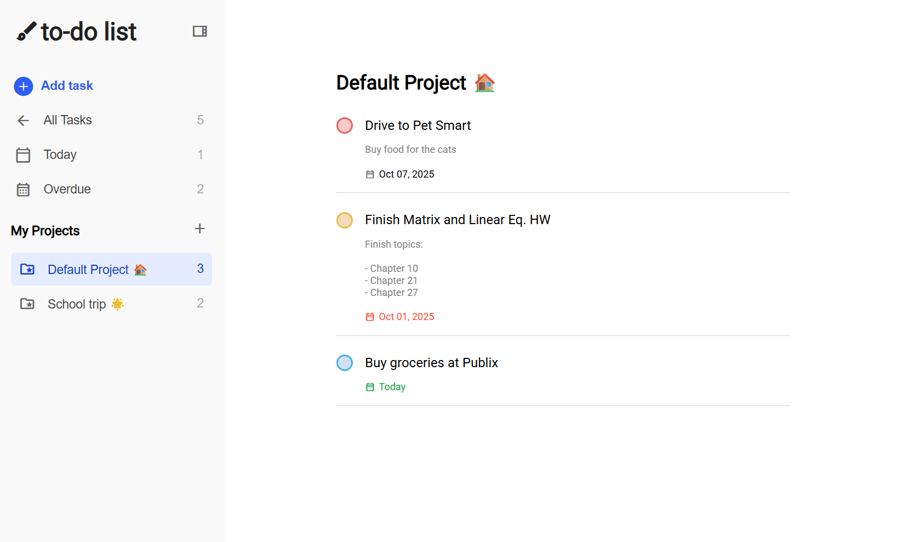

# To-Do List Application

A task management application designed to help you organize your tasks efficiently. Users can create projects to categorize tasks, set due dates and priorities, and view tasks with smart filters. This app uses the browser's `localStorage` to save all user data.

### [Live Demo](https://eggtoasts.github.io/todo-list/)

<p align="center">
  
</p>

## Features

- **Project-Based Organization:** Create, rename, and delete custom projects to keep your tasks neatly organized.
- **Full CRUD Functionality:** Create, Read, Update, and Delete both projects and their associated tasks.
- **Task Details:** Add tasks with a title, description, due date, and priority level (Low, Medium, High).
- **Smart Views:**
  - **All Tasks:** A view of every task from all your projects.
  - **Today:** A filtered list that automatically shows only tasks due today.
  - **Overdue:** A filtered list that highlights all tasks past their due date.
- **Data Persistence:** Utilizes the browser's `localStorage` to save all projects and tasks, so your data is never lost between sessions.
- **Responsive Design:** The interface is fully responsive, with a collapsible sidebar for an optimal experience on mobile devices.

## Technologies Used

- **HTML5**
- **CSS3**
- **JavaScript (ES6+)**
- **date-fns Library:** For date parsing and formatting.
- **localStorage API:** For local data storage.

## Getting Started

Follow these instructions to get a copy of the project running on your local machine.

### Prerequisites

You will need to have [Node.js](https://nodejs.org/en/) (which includes npm) installed on your computer.

### Installation

1.  Clone the repository to your local machine:
    ```bash
    git clone [https://github.com/eggtoasts/todo-list.git](https://github.com/eggtoasts/todo-list.git)
    cd todo-list
    ```
2.  Install the necessary project dependencies:
    ```bash
    npm install
    ```
3.  Run the local development server:
    ```bash
    npm start
    ```
    A new browser window will open with the application running.
